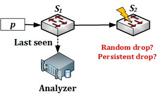
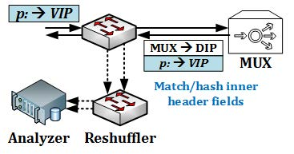
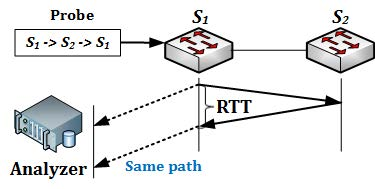
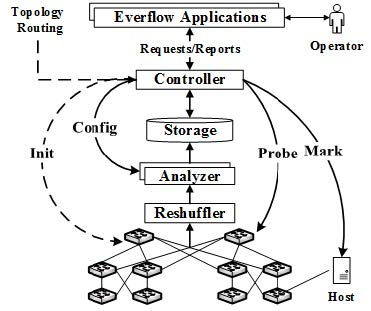
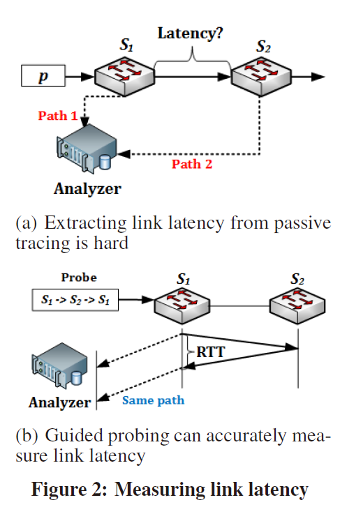

# [SIGCOMM 2015] Packet-Level Telemetry in Large Datacenter Networks

为什么包级别的网络测量技术是有用的#

(1)Silent packet drops
传统的方式在端主机感知丢包, 不能够准确定位故障交换机。包级别感知可以获得最后丢包的位置从而向最后一跳的下一跳交换机发探测包从而定位故障交换机。
(2)Silent blackhole
(3)Inflated end-to-end latency
包级别的测量可以很容易获得包路径上任意两跳之间的RTT
(4)Loops from buggy middlebox routing
导致环状路由的原因是中间件, 意味着路由表是正确的, 所以检查路由表不能识别故障。通过包路径可以很容易检测出环状路由。
(5)Load imbalance
传统的方法是粗粒度地计算link counters并不知道是哪种模式的包不均衡负载。包级别的测量可以统计出通过每条链路的五元组的包的数目, 从而识别哪种类型的五元组出问题了。
(6) Protocol bugs
Tracing
the packets of these protocols offers a reliable yet independent
way to identify protocol misbehaviors. Here network
telemetry is particularly suitable because host-based tracing
may be too expensive (e.g., for RDMA) or unavailable (e.g.,
for PFC and BGP).

#### 挑战
**(1)Tracing and analysis scalability，追踪与分析数据包的扩展性问题**
数据中心网络中传输空前巨大的流量数据，对于商用交换机而言因为限制的内存和CPU处理能力，分析其中一个很小的数据包子集都很难做到。而将数据包数据发送至商用分析服务器又会造成拥塞甚至瘫痪整个网络。另外，即使是使用能够线速(line rate，假设为10Gbps)处理轨迹数据的服务器，对于如此海量的数据仍然意味着数目众多的服务器带来的成本开销(考虑负载均衡和局部性的话可能需要的服务器数目更多)。并且，数据中心网络中的故障通常发生在多跳或多个交换机上，而要做到高效的故障诊断则需要能够在网络中智能地追踪这部分故障流量的数据包，即需要能够根据复杂的查询模式，比如匹配协议头部、源和目的地址，甚至路径上的特定设备，来搜索数据包的轨迹数据。
**(2)Limitations of passive tracing，被动测量方法的局限性**
判断Random drop和Persistent Drop很难

只有**结合多条在S2处丢包的流**才可以判断是否是随机丢包, 但是被动追踪的方式，只能捕获到网络的一个瞬时快照，效果有限。
i) 受到影响的流的数据包的数目比较少
ii) 仅仅瞬时采样到了一部分的包
即使知道了是持久故障也无法判断是不是因为黑洞的原因丢弃固定五元组的包所造成的。

#### Everflow的思想
前三个用于解决Challenge中的可扩展性问题，最后一个则克服了被动测量的局限性。
**(1) Match and Mirror on Switch**
a. 由于数据中心网络中，TCP流量占绝大多数，该规则基于TCP首部的SYN、FIN和RST字段来匹配全部的TCP数据包。
b. 除了追踪全部TCP流的数据包，还需要一种更灵活的匹配规则，用于追踪运维人员更加关注的数据包，比如特定应用相关的流量(带有特定端口号)，或特定源和目的服务器之间的流量等等。这可通过在主机端对数据包头部打上特殊标记位，EverFlow中称为Debug Bit，并为交换机配置匹配该标记的数据包的规则，应用开发者在其编写的监控应用程序中对包进行标记，就可以追踪到任何他们感兴趣的普通数据流量。
c. 在数据中心网络中，除了普通数据流量之外，还有少量的特殊协议流量，如BGP、PFC和RDMA等，尽管它们的数据量很小，但是对于数据中心网路的整体性能及健康运行有关键影响。EverFlow也为协议流量设计了专门的匹配规则。
**(2) Scalable Trace Analyzers**
**(3) Switch-based Reshufflers**
利用已有的将商用交换机转换成为硬件实现的数据选择器(Hardware Mux(Multiplexer))的工作，实现轨迹数据处理的负载均衡。其主要思想为：首先为一个交换机，即一个HMux赋予一个VIP(Virtual IP)，并将该VIP映射到一组DIP(Direct IP)，而每个DIP又与一个分析服务器对应。EverFlow中配置所有的交换机都将其所匹配并追踪的数据包发送至该VIP处。当一个被追踪的数据包到达该HMux，HMux会基于该数据包的五元组(又称Flow ID，即源/目的IP地址、源/目的端口号和协议号)作哈希，根据哈希值将该数据包转发至相应的DIP处，这也保证了具有相同五元组的被追踪的数据包会被转发至同一个DIP，即同一个流的数据包会被同一个分析服务器所处理。

HMux能够利用交换机全部的转发能力(通常大于1 Tbps)来对流量进行“洗牌(Shuffle)”，这比用于实现负载均衡的服务器的网卡(通常10 Gbps)转发速度至少快了100倍，并还能够通过配置多个具有相同VIP的HMux来进一步增强Shuffle的能力。

**(4) Guided Probing**

如果我们能够做到任意地重放(Replay)一个数据包的轨迹呢？更具体而言，如果我们能将某个特定的数据包注入到网络中，使其经过特定的交换机，并且通过为其设置”Debug Bit”以追踪该数据包的轨迹和行为呢？

如果能做到上述“如果”，现有问题会变得简单许多，基于这个思想，EverFlow引入了Guided Probe(向导探针)，本质是一个精心制作(Specially Crafted)的数据包，属性与需要重放的数据包一样，即原数据包的替身(Incarnation)，用于检验原数据包在网络中的行为。EverFlow中进一步扩展Guided Probe的功能，使其不仅能够将某个数据包注入特定的交换机，而且还可以强制该数据包经过指定的一个跳序列，类似源端路由(Source Routing)的感觉，并且通过封装(Encapsulation)的方法使得该数据包会在注入某个交换机后遵循某个预先设置好的路径。

Guided Probe一个很直接的用途在于恢复由于采样或聚合而丢失的轨迹信息、为了恢复任意数据包的轨迹，我们只需简单地将该数据包(预先标记“Debug Bit”)重新注入其第一跳交换机中即可。此外，Guided Probe还可用于克服被动测量方法的限制，比如判断某次丢包是否是持久性的，而持久性故障又是应该优先解决的，我们可以通过制作多个不同模式(如五元组)的探针数据包注入网络，来观察丢包是随机的，还是针对特定的五元组。

还可以扩展来计算RTT

发包 s1->s2->s3, 然后记录Analyzer受到s1的时间间隔来近似RTT

#### Everflow架构

初始化阶段会配置交换机规则, 匹配的包会被复制一份然后发送给Reshuffler, 然后发送给Analyzer
Analyzer会把分析的结果存储到Storage中
Controller提供API去获得分析结果, 发送probe, 配置debug bit。

Analyzers

Analyzer是一些分布的服务器, reshuffler会把特定五元组的包发送给特定的Analyzer, 
(1) Packet trace
Analyzer会维护 packet trace and counter

trace信息: 存放在一张表中由五元组和IPID来标记, 存放数据包具体信息, 以及途径每一跳的信息包括:途径交换机的ip, timestamp, TTL, source MAC address(用来识别上一跳), DSCP/ECN
ps: IPID 占16比特。用来唯一地标识主机发送的每一份数据报。通常每发一份报文，它的值会加1。

trace信息两种作用 a. 判断loop, 及同一个设备是否在一条trace上出现两次 b. 判断最后一跳丢包位置, 则可利用数据中心网络拓扑和路由策略预先计算出期待的最后一跳(Expected Last Hop),将其与数据包轨迹中包含的最后一跳进行比较，若不同则说明发生了丢包。

为减小存储开销，Analyzer仅会将行为异常的数据包的轨迹(如出现环路或丢包)、被标记有Debug Bit的数据包的轨迹以及特殊协议的流量数据包的轨迹写入存储中。而对于其余流量的轨迹信息(行为正常的流量，通常占绝大多数)，Analyzer会将其聚合成各种类型的计数器

(2) Link load counters
对于每条链路，Analyzer会基于数据包轨迹信息计算聚合负载，如流数目、数据包数目和数据量字节大小等。除此以外，它还能计算更细粒度的负载计数器，如由特定前缀的源发出的流量负载或数据中心内部流量负载，通过Controller所提供的相关API，EverFlow应用程序可以动态增加或删除这种粒度较细的负载计数器。
(3) Latency counters.
Analyzer会根据Guider Probe的轨迹信息计算每条链路的时延信息。
(4) Mirrored packet drop counters.
镜像数据包在到达Analyzer的路上同样可能发生丢包，但是通常很好判断。根据事先计算好的路径与实际收集到的轨迹信息比较，信息缺失的那一跳就是发生丢包的位置，Analyzer同样会为这种情况维持一个计数器。

#### Everflow应用
(1) Latency Profiler
Latency Profiler会在源主机端标记该TCP连接的SYN数据包的Debug Bit，用于在全网范围内追踪该数据包的轨迹，从而可以获知其路径上经过的每个网络设备信息，之后就通过Controller提供的Probe()的API向每个网络设备注入探针，从探针包的轨迹信息中可计算出每跳的延迟(Per-Hop Latency)。对于端主机间延迟较高的问题，Latency Profiler利用类似“源路由”的方法，如上图(b)所示，发射预先指定路径为“S1->S2->S1”的探针，此时测量到的延迟数据实际是链路(S1,S2)的RTT(Round-trip Time)，即往返时延，而非单向链路延迟，如图(a)中所示，如果仅仅以该数据包从S1发出的镜像与从S2发出的镜像到达分析服务器的时间差作为链路(S1,S2)的延迟，一个很明显的缺陷在于从S1到达分析服务器的路径 Path 1，以及从S1经过S2再到达分析服务器的路径 Path 2 可能大相径庭，从而这两条路径中后者仅比前者多一条链路(S1,S2)的理想情况可能与现实相差甚远，测量结果更难言准确。

(2) Packet Drop Debugger
Packet Drop Debugger会去检查判断为已丢失的数据包的轨迹，找到其轨迹显示的最后一跳 $S_n$，即该数据包最后被捕获的位置，可根据该跳的转发表中对应表项对应的输出端口来推断其下一跳，或者直接根据数据中心拓扑信息与路由策略来推断其下一跳。之后Packet Drop Debugger向 $S_n$ 注入探针，以确定该丢包是持续性的(重要，必须解决)还是暂时性的(不那么重要，甚至可忽略，大多数时候任其自行修复)，如果是持续性的则还需要判断该丢包是随机的(端口故障)还是具有某特定模式(如匹配固定五元组，可能因为路由表对应表项崩了)。

(3) Loop Debugger
Loop Debugger会去检查判断为出现环路的数据包的轨迹，并向网络中注入探针以检测环路是否持续存在，如果环路仍旧存在那么它就会向运维人员发送一份环路所涉及设备的清单，后者可以简单地关闭一些设备接口以打破环路。应用会继续发送探针，直至环路消失。

(4) ECMP Profiler
在数据中心网络中，交换机通常使用ECMP。由于糟糕的哈希函数或路由问题，负载的分配可能会非常不均衡，从而导致链路出现拥塞。应用ECMP Profiler专门用于分析负载均衡问题。

针对每个交换机，ECMP Profiler会监控每条链路的聚合流量。一旦检测到不均衡的负载分配，它就会通过访问更细粒度的负载计数器以判断不公平的负载分配是影响到了全部的流量，还是总流量的子集(如从某固定前缀网络发出或去往固定前缀网络)。
(5) RoCEv2-based RDMA Debugger
基于RoCEv2的RDMA是一种新兴网络协议，可在低CPU开销情况下实现高吞吐量(40 Gbps)和极低时延(毫秒级)。通过采用PFC来实现无丢包的以太网架构，RDMA协议的实现可被进一步简化并Offload到网卡上去。然而在文中提到的微软的数据中心网络中，由于网卡中的软件错误，RDMA经常难以获得其最理想的性能。而调试此类问题的困难在于网卡是由第三方厂商制造，调试网卡中的RDMA代码的工具十分有限。作者为此设计了应用RoCEv2-based RDMA Debugger专门用于分析RDMA流量问题。

RoCEv2-based RDMA Debugger会追踪所有RDMA相关的控制数据包，如PFC和NACK，这些控制报文的轨迹就提供了一个可靠且相对独立的方式使我们不仅能够观察到RDMA网络流的真实行为，也有助于调试第三方厂商在网卡中的实现代码。

#### 实现
(1) Switch Configuration2

默认首先配置各个交换机中TCAM表中用于匹配TCP流量中的SYN、FIN和RST等标志位被置位的数据包的规则。并使用DSCP(Differential Service Code Point，差分服务代码点，共6个Bit)字段中的一个Bit作为Debug Bit，以及IPID(IP Packet Identification，IP数据报标识，用于标记同一个IP数据报的多个分片，共16个Bit)字段中的n个Bit用于从 $2^n$ 个数据包中采样到某一个，如配置使用IPID字段中的10位进行匹配的规则，就可以每1024个数据包中取样到其中1个。由于每台交换机都配置有相同的匹配规则，那么采样数据包的集合就会在所有的交换机上是一致的，即都会采样到相同的数据包。

对于封装过的数据包，如被Hux封装过的，配置规则使其按照其内层的TCP/IP头部进行匹配，使得该数据包会与其原来的未封装过的数据包(即内层数据包)会最终经过Shuffle被发往同一个分析服务器。

最后，还配置有用于匹配以太网类型为0x8808，即二层控制报文(包含PFC)，TCP端口为179的(BGP)以及RDMA的NACK。

综上，在交换机中配置的匹配规则大约20条左右，仅仅占用了TCAM表中很小部分的内存空间。

当数据包匹配到上述任何一条规则，交换机就会将其镜像发送至ReShuffler，并且是以GRE(Generic Routing Encapsulation)格式封装，数据包格式如下图所示，可以看到有内外两层头部信息，其中外层源IP地址为镜像交换机的回环地址，目的IP地址为是Reshufflers的VIP，而外层数据包的载荷即为原数据包。在外层的GRE头部中有个协议字段，用于表示本数据包是EverFlow镜像数据包，而交换机会配置有一个黑名单以防止对镜像数据包再次镜像。

“Match-and-Mirror”完全在交换机的数据平面实现，利用了交换机ASIC芯片强大的数据处理能力，并对交换机的CPU没有造成任何开销。

(2) Guided Prober
Guided Prober的核心功能在于生成任意所需数据包并注入到指定目标交换机中。它使用 Raw Socket API 来修改任意的数据包字段，如IP和四层(TCP、UDP和ICMP等)等头部字段。探针的Debug Bit会被标记便于追踪，并且在其载荷中携带一个签名使其可被EverFlow Analyzers识别。

要将某个探针 $p$ 发送给某个交换机 $S$，利用了商用交换机普遍具备的解封装(Decapsulation)的能力。首先，将探针 $p$ 封装在 $p’$ 内部，并以交换机 $S$ 的环回地址作为其目的IP地址，之后将其发出。交换机 $S$ 接收到 $p’$ 之后执行解封装得到原数据包 $p$，然后就可以根据正常转发逻辑对其进行转发并观测其行为。

实际上，通过多次封装的方法还能使得某数据包流经固定的路径，这不难想到。

另外，为了防止探针数据包对于服务器应用程序的影响，故意将其TCP或UDP的校验和设置错误，这样探针会被目的主机丢弃。

(3) Analyzer

Analyzers使用一个定制的数据包捕获程序库来捕获镜像数据包，该库支持RSS(Receiver Side Scaling)，它允许Analyzer使用多个CPU核来接收数据包。该库根据源和目的IP的哈希结果来将数据包映射到某个CPU核，从而可以通过运行多个线程来最大化吞吐量。

(4) Storage
EverFlow的存储设计基于SCOPE来实现。在SCOPE中数据被组织为具有多个列的多行表格结构，EverFlow将数据包Trace存储在一个包含多个列的表中，这些列包含Trace三个方面的内容：① 完整的数据包内容，头部和载荷被存储在单独的列中以简化查询；② 每跳(Per-Hop)信息，如时间戳、TTL、源MAC地址和DSCP-ECN字段值，由于每个数据包流经的跳数是不同的，将其所有的每跳信息组合合并到一列中去；③ Trace的元数据，包括Trace长度，是否为探针，是否包含环路或丢包。这些Trace能通过Controller提供的上述API基于filter、Condition和时间范围(StartTime~EndTime)查询。
类似地，将来自所有的Analyzer的计数器Counter存储在一个表中，表中的每一行代表来自某个Analyzer的某个Counter的快照，除去Counter的名称(键Key)和数值(值Value)，该行还包含Analyzer的ID以及快照对应时间戳。在响应计数器查询时，Controller会将匹配给定Counter名称和时间范围的全部行的Counter值进行求和之后再行返回。