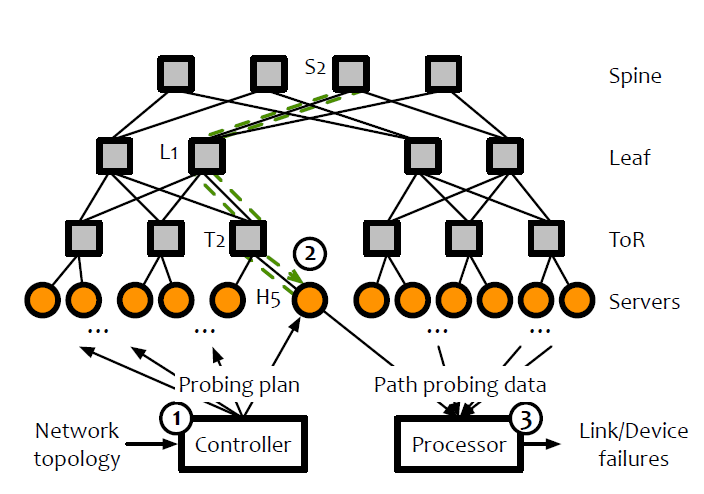
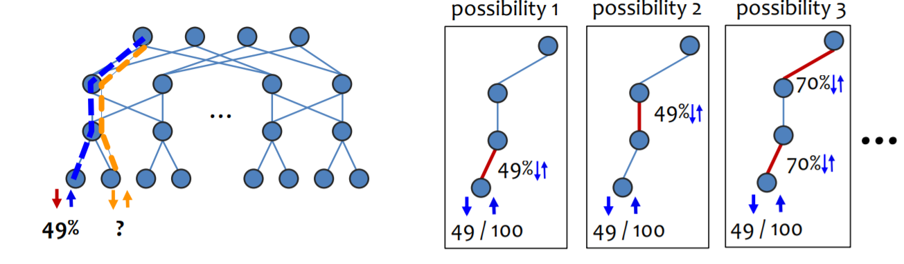
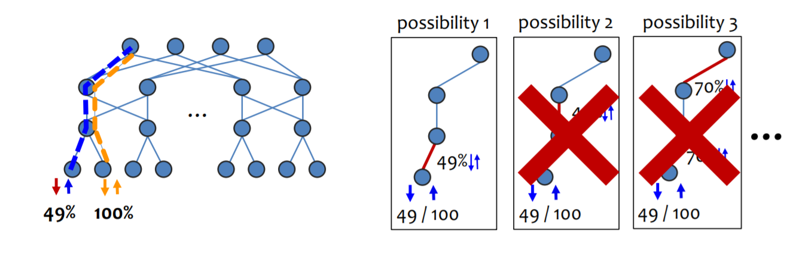
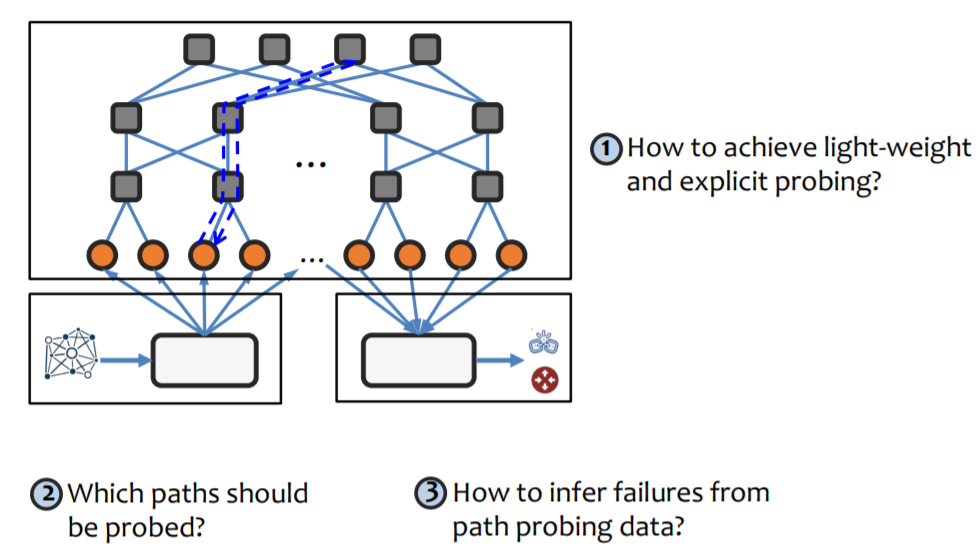
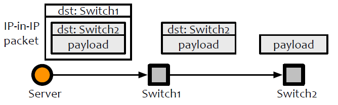
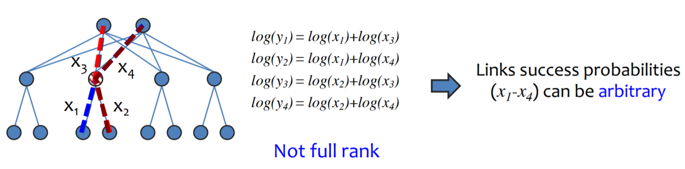
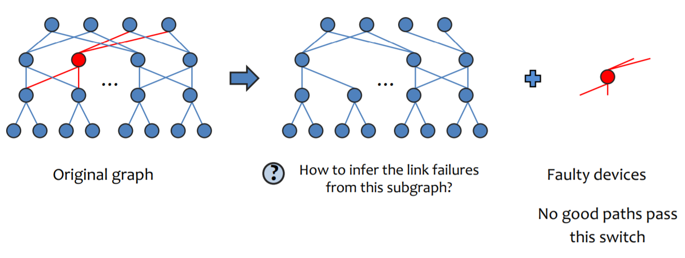
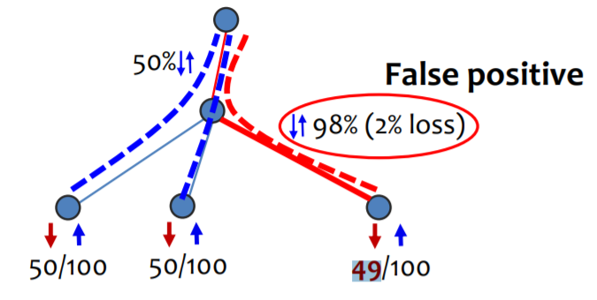

## BackGround
在大规模的数据中心网络中，故障和事故是不可避免的，包括路由错误配置、链路抖动、网络设备硬件故障和网络设备软件错误

在大型数据中心定位网络故障是一项挑战。考虑到现在数据中心在任何两个终端主机之间都有高度重复的路径，终端主机不清楚发生故障时（例如，TCP重传）应该归咎于哪些链路或设备。而且，由于等成本多路径（ECMP）路由协议，即使路由器也不知道包的整个路由路径。

此外，灰色故障，即局部或细微的故障，在数据中心中普遍存在。它们会导致云环境中的主要可用性故障和性能异常。与fail-stop故障不同，gray故障是有概率地丢弃数据包的，因此不能通过简单地评估连通性来检测。

首先，对于灰色故障的检测，故障定位系统需要一个终端主机的视角。灰色故障被描述为“差分可观测性”，这意味着终端主机和其他网络实体（如交换机）对故障的感知不同。因此，传统的监测系统，如SNMP，NetFlow，查询交换机的数据包丢失，无法观察到灰色故障。

NetBouncer可以很好解决fail-stop和gray-failure问题。
## System
NetBouncer处理流程

1. 控制器设定探测规则，发送给服务器。
2. 服务器发探测包
3. 处理器收集探测结果推断故障。
模型如下: 
$y_{j}=\prod_{i: \operatorname{link}_{i} \in \text { path }_{j}} x_{i}, \forall j$
yj: pathj 不丢包的概率, xi linki无故障的概率
希望解决问题如下:
给定图G, 对于图G中的所有路径U, 可以找到$A \subseteq U$ 使得这些路径构成的方程组可以获得所有link的xi的唯一解。下面是识别故障的例子：

## Algorithm

**1. 如何实现轻量化和显式探测**
**IP in IP**(显式探测,可以解决多条路径冗余不知道具体路径问题)

The switch that receives the IP-in-IP packets (i.e.,Switch1) would decapsulate the outer IP header and forward the packet to its next destination
**Packet bouncing**
The probing path contains the route from the server to the switch (H5->T2->L1->S2) and its “bouncing back” route (S2->L1->T2->H5).
1. 链路可以被双向探测
2. 探测路径的接收方和发送方是同一台服务器。如果不是同一台服务器可能会出现下面的问题:
如果接收方挂掉，会导致假阳性(本来link没问题, 结果预测有问题)
如果发送方挂掉，会导致假阴性(?)
3. 可以最小化ip-in-ip的header的数目。因为对于Clos network, 从底层服务器到上层交换机有唯一路径

**2. 如何选择探测路径**
选择探测路径需要保证所有的链路可以唯一计算出概率xi
有些情况是不能唯一计算出xi的:

理论:(充分必要条件) 在具有k层交换机（k>=1）的Clos网络中，**通过探测从服务器到顶层交换机的所有路径**，我们可以从测量的路径成功概率中唯一地推断链路成功概率，当且仅当每个交换机至少被一条成功概率为1的路径通过。(证明见论文)

**3. 如何根据探测结果推断故障**
**设备故障**
对于每个设备, 计算穿过设备的path的成功概率, 如果有一个path成功概率是1, 该设备记录为gooddev, 否则记录为baddev。然后从Graph里面删除baddev部分。Graph = SubGraph + baddev

**链路故障**

$\begin{array}{ll}\operatorname{minimize} & \sum_{j}\left(y_{j}-\prod_{i: \operatorname{link}_{i} \in \text { path }_{j}} x_{i}\right)^{2} \\ \text { subject to } & 0 \leq x_{i} \leq 1, \forall i\end{array}$

存在问题:
噪音导致假阳性: (1)发送一定数目探测包测的本来就不是准确的概率值(2)因为某些软硬件原因也会导致丢包(TCP/IP,OS...)

假设最上方链路丢包率是50%, 三条路测到的丢包率分别是50%，50%，49%.
前两个测量正确没有影响，最后一个存在误差，带入上面的模型就会导致98%的假阳性问题。
所以加入了正则化项:

$\sum_{j}\left(y_{j}-\prod_{i: \operatorname{link}_{i} \in \operatorname{eath}_{j}} x_{i}\right)^{2}+\lambda \sum_{i} x_{i}\left(1-x_{i}\right)$

