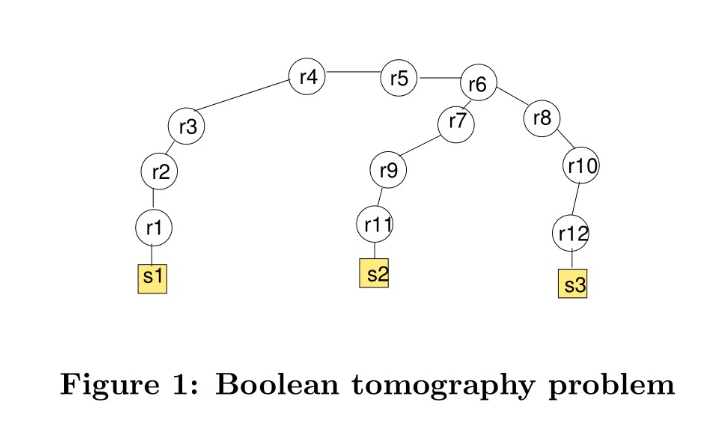
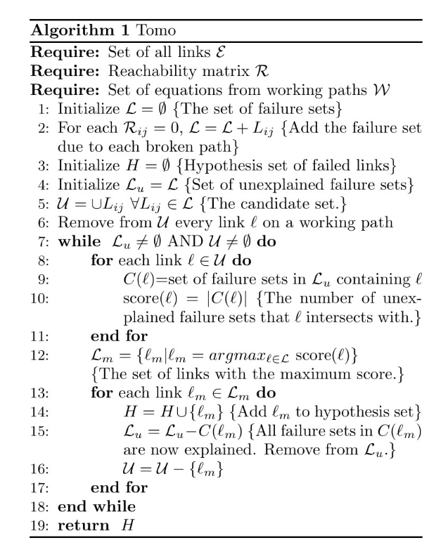
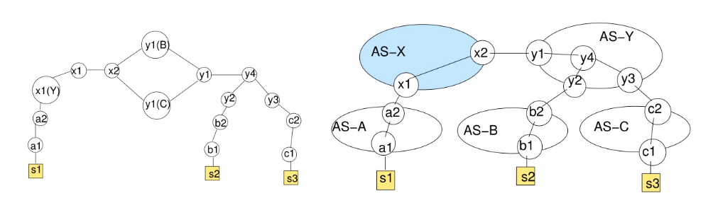
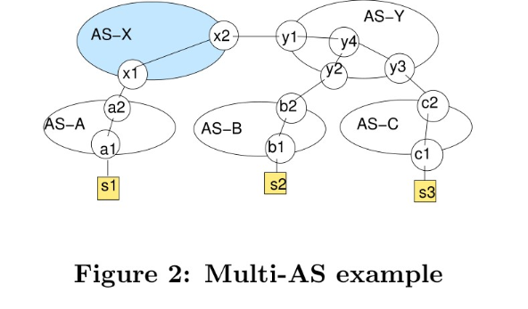
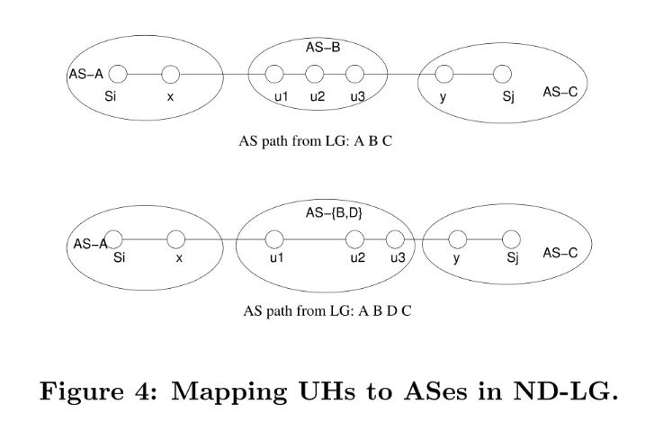

# [CoNEXT 2007]NetDiagnoser: Troubleshooting network unreachabilities using end-to-end probes and routing data

## 1. 背景
**解决问题:** 
1. 非瞬时性网络故障定位。
2. 路径冗余（由于多宿主或负载平衡）并不总是能够防止多个相关链路或路由器故障，以及路由器的错误配置可能导致该路由器只在某些路径上起到作用,需要网络操作人员对故障点进行修复。
3. 放置传感器: 
传感器的位置是固定的（例如，传感器可以与终端主机、数据中心、web-server共用一个位置) 算法的目标是只诊断导致了一些传感器之间的不可接近性的故障。

**网络故障产生原因:**  
1. 物理链路和路由器故障会影响IP路径。
2. 路由器错误配置（如错误设置BGP策略或数据包筛选器）可能导致路由器只在一部分IP路径上起作用。

## 2. Tomo 算法
**Boolean tomography algorithm(BTA)问题:**   
 
假设链路r9-r11出故障, s1-s2: broken, s1-s3: working. 为了最小化假阳性(flase positive)  Boolean tomography algorithm将会把r6-r7标记为broken, 因为链路r6-r7距离s1是最近的。但是实际上{r6-r7, r7-r9, r9-r11}均有可能出故障。BTA算法在没有更多信息的情况下，不可能缩小潜在故障链路的范围。  

**Tomo架构:**  
Tomo架构有三部分组成
1. 传感器
传感器的位置是固定的 (例如，传感器可以与终端主机、数据中心、web-server共用一个位置) 传感器tracerout所有其他传感器记录可达性结果。
2. troubleshooting进程
在每个AS中都部署一个troubleshooting 叫做AS-X, 传感器将tracerout结果汇报给AS-X, AS-X构造矩阵R. 
因为负载均衡会导致不同的sensor之间会有多条路径。用Paris traceroute可以发现sensor对儿之间的所有路径.
3. Tomo算法: Greedy heuristic  
 
**符号说明**
L: 所有故障链路集合的集合
W: 所有工作链路集合的集合
H: 可能故障链路的最小集合, 满足和L中所有集合的交集都不为空, 和W中所有集合的交集都为空。
U: 所有未被覆盖到可能故障链路, 初始值为L中所有集合的并集
Lu: 所有未被覆盖到的集合的集合, 初始值Lu=L
**算法过程**:
```
1.删除U中在W中出现的链路
2.遍历U中的所有链路, 计算score(l) = L中包含l的集合的个数。
3.选择score最大的链路(可能有多个)作为集合Lm
4.更新L, H, U
Lm加入H中  
Lu中删除Lm所在的集合  
U中删除在Lm中出现的所有元素  
5.返回第2步, 直到U或者Lu为空
```
## 3. Tomo 改进
一些实际问题的限制会影响Tomo算法, 需要结合实际进行改进。
1. 路由器错误配置, 某些链路只在部分路径上起作用。如何识别路由器错误配置是个问题。
2. 链路坏掉之后, 重新路由产生新的路径, 可以利用这部分信息更精准地缩小预测的故障链路集合。
3. 控制平面的信息也可以利用。如IGP和BGP Message。
4. 因为Tomo算法是基于Traceroute的, 有些AS阻塞Traceroute, 会导致有些链路接口不能被发现。

### 3.1 ND-edge
使用逻辑链路和重新路由信息的改进版本的Tomo算法叫做ND-edge。
#### 改进一: 针对路由器错误配置的问题改进
**Motivation:**
希望Tomo算法可以检测出路由器被错误配置后导致的链路只对部分IP path有效的故障。
**方法:**
逻辑链路转化法: 
如果链路是在域内, 那么使用域内的拓扑在最终的拓扑中不会改变。
如果链路是在域间, 那么一条链路将被标记为多条可以通向sensor的链路。
例子：左图是逻辑链路, 右图是实际链路
 
在正常情况下，y1会通知x2它学到的通向AS B和AS C的路径。假设现在y1被错误配置, 它仅向x2通告通往B的路线, 没有宣布通向C的路径。
Tomo算法会将x2-y1(C)和y1(C)-y1加入到最终的预测故障链路集合中, 但是x2-y1(B)和y1(B)-y1并不在之中,从而推断出x2-y1是被错误配置的链路。

#### 改进二: 针对重新路由信息进行改进
**Motivation:**
可以利用重新路由前后的IP path信息去更精确地确定故障链路。
**方法:**
例子:
假设故障发生前某一个IP path: p- = {l1,l2,l3,l4} 
故障发生后重新路由 p+ = {l1, l2, l5, l6}
可以判断出l3和l4是潜在的故障链路, 集合p = {l3, l4}就会被加入到R中。(R是重新路由判断出来的潜在故障链路集合的集合。)
Tomo算法改变: 
score(l) = L和R中包含l的集合的个数。
### 3.2 ND-bgpigp
#### 改进三: 针对利用控制平面的信息进行改进
**Motivation:**
使用控制平面的信息可以再次缩小可能故障链路集合。
**方法:**
IGP 信息:AS-X可以直接通过IGP的"link down" message 直接推断出来故障链路。
BGP 信息:可以通过BGP目的前缀撤回的信息推断出传感器是不可达的。
例子:

假设s1-s2和s1-s3均故障, 哪个根据Tomo算法, 返回的可能故障链路应该是{y4-y1, y1-x2, x2-x1, x1-a2, a2-a1} 现在假设在故障之后，x1从a2收到一个撤回前缀A的路由，对应
传感器s1,这表明失败的链接必须位于AS-X和s1之间的路径的一部分上。 AS-X可以删除链接y4-y1，y1-x2，x2-x1和x1-a2 从而减小了假设集合的大小。
### 3.3 ND-LG
#### 改进四: 针对traceroute被阻塞的问题进行改进
**Motivation**
traceroute阻塞会导致域内路由的接口ip用*表示无法获得具体的ip, 导致相关的链路无法被故障检测出来。
造成traceroute阻塞的原因: 
1. AS可能因为隐私原因封掉traceroute.
2. 几乎所有路由器都对ICMP响应进行速率限制。
3. 路由器有时会从与接收传入数据包的接口不同的接口发送ICMP响应，并且该接口可能具有私有IP地址。

**方法:**
假设如果一个AS阻塞了路由跟踪，则该AS中的任何路由器都不会响应，如果一个AS允许跟踪路由，则该AS中的每个路由器都将以有效的IP地址进行响应。 
忽略AS中只有少数路由器由于ICMP速率限制而没有响应的情况，因为可以通过为源-目的地对儿重复进行traceroute解决此问题。
Looking Glass servers可以通过请求目的ip地址返回AS路径。
步骤: 
1. 将UH(禁掉traceroute的域内路由器)映射到AS
例子:

u: 被禁traceroute的域内路由。  
假设Si-x-u1-u2-u3-y-Sj是一条P path. 其中u1, u2, u3是不能被获取ip的域内路由器。查Looking Glass Server可以获得AS path  
a. AS-path 是A-B-C 那么可以确定u1,u2,u3 在AS-B中.  
b. AS-path 是A-B-D-C 那么可以确定u1,u2,u3在B或者D中.  
2. 将相同的链路进行聚类获得linkCluster集合 
假设l1 = u1u2 , l2=u3u4
AS-X 使用下面的规则确定l1和l2是否是同一条链路。
(i) u1和u3必须在同一AS中, 也就是step1中获得的标签是一样的。u2和u4同理。
(ii) l1和l2必须不在同一个path中出现。
(iii) l1和l2在L集合(潜在故障链路集合)中出现的次数是一样的。
(好像不是充要条件, 应该是必要但是不充分？？)
3. 修改Tomo中计算score的方式
假如说u是匿名链路
score(u) = (L中的元素 ∩ linkCluster(u)!=empty)的个数。 
```python
for l in L: 
    if l ∩ linkCluster(u)!=empty 
        score(u)+=1
```
每条path上都会有一些匿名链路, 但是有可能这些匿名链路是同一个链路
{l1,l2, u1, u2}
{l5, l6, u3, u4}
如果说u1和u3是同一个链路那么score(u1)=score(u3) = 2

## 4. 实验

**实验模拟平台:** 
BGP模拟器: C-BGP, 可以模拟multi-AS topologies, IS-IS and BGP message exchange, and traceroute.
实验模拟拓扑: 
三个核心AS, 22个二层AS, 140个3层AS
三个核心AS是Abilene, GEANT, 和WIDE, 之间相互连接。其中二层AS是星型拓扑, 由12个节点组成, 三层AS由1个节点组成.

**指标:** 
检测能力
$\mathcal{D}(\mathcal{G})=\frac{\text { number distinct hitting sets }}{\text { number probed links }}=\frac{|\mathcal{H} S(\mathcal{G})|}{|\mathcal{E}|}$
hitting set: h(l)是链路l所在的路径集合。
HS(G)是h(l)的集合
$\mathcal{E}$是链路的数目
如果说每一个l所覆盖的集合不一样也就是说产生的可达性矩阵R都不同, 那么就能够确定地检测出故障链路。
如果说l覆盖的集合全都一样, 就是说产生的可达性矩阵都一样, 那么就无法确定故障链路。

**Sensor的放置方法**
四种放置方法:
1. 和AS位置一致
2. N/2放在一个AS中, 剩下的放在其他的AS中
3. N/2以2的方式放置, N/2放在网络的内部节点中
4. 随机放置在边缘

实验获得方法4对应的指标最差, 后续的实验均通过随机放置传感器来进行, 这样说明使用其他方法只会更好, 使得结果更有说服力。

模拟拓扑上随机选择10个sensor发现检测能力在0.25-0.6之间波动, 在PlanetLab上选则10个节点检测能力为0.41说明模拟符合实际

## 5. 评估
**评价指标:**
1. sensitivity $=\frac{\text { number true positives }}{\text { total number failed }}=\frac{|F \cap H|}{|F|}$
Sensitivity measures how well the algorithm is able to
detect the actual failed links.
2. specificity $=\frac{\text { number true negatives }}{\text { number non-failed }}=\frac{|(\mathcal{E} \backslash F) \cap(\mathcal{E} \backslash H)|}{|\mathcal{E} \backslash F|}$
Specicity measures the number of false positives produced
by the algorithm.

**实验方式:**
实验分为: link failures(同时断掉1、2、3个link)、router failures和router misconfigurations. 
每个场景下模拟1000次每次, 10个传感器每次100 failure
模拟场景方法: 
- 链路故障: 直接把link给broke掉
- 路由器故障: 和路由器连接的link给broke掉
- 路由器错误配置: 随机选择域间链路, 然后选择链路的一端路由器作为目标, 对该路由器路由表中的某些路由进行export-filter, 就会导致路由器不会向peer通告选中的路由。然后让C-BGP收敛运行到稳定状态, 再进行traceroute。

**Tomo 算法:** 
1. 单一链路故障一定包含在最终的集合H中, 因为只有故障没有被恢复(也即重新路由)的时候才会调用Tomo算法。不存在重新路由的信息。
2. 多链路故障不一定: 因为多个链路中可能某些链路故障可能被重新路由, 但是Tomo算法并没有利用重新路由的信息, 所以故障链路不一定包含在集合H中。
3. Tomo无法识别路由器配置错误，因为它假定任何承载工作路径的链路都是正常的。

**ND-edge**
1. 在多链路和路由器的错误设置中的情况中, ND-edge算法的sensitivity指标较好。(sensitivity = 1)
2. 路由器错误设置识别的specificity指标比单一链路故障的指标要好。将拓扑扩展为逻辑链路之后, 可以清除集合H中的一些元素。使得集合H变小
3. 最终H集合中link的数目远远小于总link数目。
4. 基于AS计算指标Sensitivity和Specificity, 发现ND-edge算法可以很精确地定位故障链路位于哪个AS中。
5. 当路由器连接的一个链路被检测出来就认为该路由器故障被检测出来。路由器故障模拟实验黑河和多链路的结果类似。

**ND-bgpigp**
1. 如果所有失败的链路都位于AS-X内，则使用IGP信息可确保始终可以找到确切的失败链接集。
2. 如果故障链路位于AS-X外部, 则使用BGP withdrawl信息可以缩小最终的H集合, 从而提高specificity。
3. AS-X位置的影响: 当AS-X是核心AS时，它很可能位于多个路径的中间，并且能够删除上游链接的可能性更高。所以核心AS-X比边缘AS-X的效果好。

**ND-LG**
fb 表示阻塞traceroute的AS所占的比例。
1. 随着fb的增加, ND-LG算法的AS-Sensitivity基本不受影响，而ND-bgpigp的Sensitivity逐渐减小(大概是1-fb, 因为阻塞部分的AS无法被检测到)。
2. AS-Specificity变化不大, 但是ND-LG算法更小一些, 因为ND-LG最终获得集合H更大一些。
3. 改变AS中可以查询Look Glass Server的比例, 可以发现ND-LG的指标变好, ND-bgpigp无变化。

## 挑战
1. 瞬时的链路抖动也会导致检测出故障。
解决: 在连续检测过程中多次检测到故障时候才会认为是非瞬时故障。
2. 假设检测的时间很短且在检测期间网络链路状态不发生变化。
解决: 可以并行地运行traceroute减少检测的时间。


