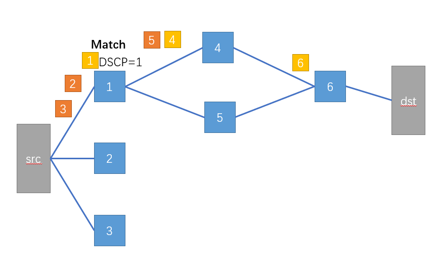

# [NSDI, 2017] Passive Realtime Datacenter Fault Detection and Localization
## 背景
本文提出的架构是部署在facebook数据中心的故障定位系统。主要是通过终端主机收集传输层流量指标和网络I/O系统调用延迟(包括retransmission, cwnd, ssthresh, ssrtt), 并通过packet mark技术将上述指标与link相关联, 进而应用t检验, ks-2检验, 卡方检验识别异常值并定位故障。
该系统可以定位识别partial-failure,包括一定程度的丢包和较长的时延。
## 优势
1. 可以利用完整的链路信息,过去的一些工作将故障归因于某些组件或者完整的链路。
2. 被动检测无需主动发包降低网络资源开小
3. 无需特殊的交换机支撑(过去的一些工作可能需要交换机扩展的ASIC功能)
4. 无需对单一应用建模: 比较链路之间tcp指标的差异, 不需要显示的性能阈值。
5. 快速的实时分析: 每10-20s的间隔可以识别出0.5%的丢包
## 系统架构

**1.Core和Agg负责标记包的路径**
Host可以收集flow的五元组(src,dst,sport,dport,protocol), 根据数据中心拓扑的性质知道(src,dst,Core)就可以唯一确定path。所以只要给每个核心交换机分配一个id, 当packet发送过去的时候, 使用交换机进行标记就可以唯一确定path, 和核心交换机相连接的Agg交换机同样可以对数据包进行标记。文章给了几个可选的标记: ipv6 header/ipv6 DSCP/ttl
对于更General的拓扑, 可以使用**S. Savage, D. Wetherall, A. Karlin, and T. Anderson. Practical Network Support for IP Traceback. SIGCOMM, Stockholm, Sweden,2000. ACM.** 中的方法实现ip path的确定。

经过每一跳交换机, 交换机就会标记连接link数目的数据包, 然后下一个交换机检测到匹配,就把DSCP设置为1, 然后dst收到数据包之后就会还原出path。
数据包数目>=H*C则可以还原出路径。

**2.Host会通过收集到的指标进行故障推断**
每间隔10s采样一次, 然后会收集到每个等价集合内link的指标。
We use Linux **eBPF** (Extended Berkeley Packet Filter) [3] along with **bcc** (BPF Compiler Collection) [2] instrumentation at end hosts to read packet markings and derive flow paths.
ex: flow1: {link1,link2,link3} 那么flow1的指标就是3条link的指标。

**等价集合1:** 4 uplinks from each ToR to pod Agg layer
**等价集合2:** N uplinks from pod Agg layer to core layer
文章认为在等价集合里面的link在正常情况下指标的分布是一致的。
也通过了一个简单的实验进行了验证。通过箱线图可以看到被故障注入的链路相对于其他链路的指标cwnd偏小,ret偏多。

基于等价集合来比较而不是基于路径来比较原因如下: 
(1)Combinatorial	disaster:	O(10,000)	paths	from	single	host	to	remote	racks.(host上的path太多了)
(2)No	localization:	doesn’t	tell	us	which	link/switch	is	at	fault.(判断出来path出故障也不知道具体是哪条link出了故障)
Thus, each metric is bucketed four times: into the inbound and outbound rack and aggregation (up/down)links traversed
**3.switch**
(1)一旦故障被中心控制器发现, 交换机重新路由避开故障组成部分。
(2)还有一部分交换机会给host发信号告知路径信息。比如与core连接的Agg交换机可以对数据包进行标注。

**4.故障链路推测方法**
**思想**
确定链路是否有故障可简化为确定在该链路上采集的样本是否与无故障链路属于相同分布的一部分。
假设故障的链路数目小于正常链路的数目, 对于重发包的数目指标,有两种情况
(1)观测链路是坏的: 
通过该链路的流的重发包数目指标分布, 相对于其他链路的重发包指标分布是**显著**右偏的。
In the former case, the distribution under test is skewed significantly to the right of the aggregate; 
(2)观测链路是好的:
通过该链路的流的重发包数目指标分布, 相对于其他链路的重发包指标分布是**轻微**左偏的。
In the latter, it is skewed slightly to the left (due to the influence of the single faulty link in the aggregate).
**具体方法**
对于一条流来说, 每一个指标被记录四次, 进出rack, 进出agg,可以双向发现link的故障。最终输出 **(t-stat,p-value,link-id)**
对于单一观测link, 会记录通过该link的所有flow的指标, 与所有link的分布进行比较。
**t检验比较retransmission原假设,观测link和其他link均值是相近的**将样本均值(观测link)与总体均值(其他link)进行比较，如果样本均值较大，则拒绝原假设(样本均值和总体均值差距比较小)
在每个周期内, host会计算t-statistic就是p-value是否是在0-0.05之间的, 如果是就拒绝原假设也就是说link有故障。
**Kolmogorov-Smirnov (KS-2) test比较cwnd, srtt,ssthresh**
**4.Controller**
(1)过滤一些假阳性现象(比如因为短暂的拥塞引起的)
**思想**
假设在没有故障的情况下, 假阳性是分布均匀的。
控制器会从host收集到link的判断结果,得到每个link被判断为正常的次数和故障的次数。
**卡方检验:原假设,在没有故障的情况下所有link被标记为正常的次数是相近的。**
如果p-value<0.5 就把最少标记为正常的link标记为故障, 然后继续迭代进行, 直到没有标记更新。

(2)visualization/logging or rerouting of traffic around faults

## 场景
1. 延时敏感服务
使用iptables,让host去随机丢掉一些特定路径上的包。
对于故障链路来说,cwnd和ssthresh的较小，而重传的较大。
2. 大数据处理服务
要么连接的网络缓冲区中有空间，在这种情况下，数据将立即被缓冲，要么缓冲区没有足够的空间，导致应用程序等待。当数据包被传输时，缓冲区被耗尽。然而，如果一个错误导致数据包丢失，则需要重新传输数据包，从而导致网络缓冲区的输出下降。相应地，缓冲区保持满的时间越多，**send()** 和类似的阻塞系统调用的延迟分布就越大。包重新排序引起的延迟也有类似的影响。非阻塞发送也表现出这种行为；可以检测**select()或epoll_ctl()** 系统调用来深入了解缓冲区行为。
验证性实验: 
[35]代表了Facebook数据中心中Hadoop工作负载的已发布流量大小分布。将一台服务器指定为接收器，其余的服务器作为源。从9个核心交换机选1个进行包丢弃。在固定的时间段内，每个源服务器都会同时创建固定数量的发送方进程。
**每个发送者都会启动一个新的流到接收器，从Hadoop服务器的Facebook流大小分布中选择一个流大小，并将流传输到完成，同时记录每个select()系统调用的等待时间**

## 实验
#### 实验环境: 
1. Facebook datacenter 
86个web server
故障注入: 使用iptables在host端选择性地丢弃一些路径上的包(DSCP标记)
2. 小的实验拓扑结构如下:

故障注入: 在core和agg之间加一个网桥, 就是一个服务器, 然后这个服务器会随机丢包。
#### 具体实验
1. 例子
产生A,B,C三个故障, 间隔为1min, 每个都随机丢包0.5%.然后按照C,B,A的顺序恢复。

controller收到host的判断结果后会迭代地进行,首先计算all-links的p-value,然后发现A故障,接着移除A以此类推判断出A,B,C故障。
2. 故障定位速度和灵敏度分析
(1)Loss rate sensitivity
控制器间隔时间越长,对捕捉低影响故障的敏感性就越高.

(2)High latency detection

used Linux tc-netem on our ‘bump-in-the-wire’ network
bridges to add constant delay varying from 100 to microseconds to 1 millisecond
构造c/s流量,然后在client端记录。
每个服务器同时处理180个并发的客户端请求,请求大小为100B或者8KB

3. 准确度分析
(1)Concurrent unequal faults
当同时出现两个故障时,一个故障随机丢包0.5%, 另一个故障丢包率在0.15%-0.25%之间。和图a相比可以看出对于一定丢包率的故障需要更长的interval才可以检测出来。文章说丢包率高的错误会对丢包率低的错误有一定遮蔽作用,导致丢包率低的错误更难被检测出来。我觉得原因可能是当观测链路为丢包率低的故障时,和其他剩余链路比较(包含丢包率高的链路和正常链路),丢包率高的链路对整体的均值影响较大,可能导致总体均值和观测链路差距较小。

(2)Large correlated faults
一个单一硬件故障可能会影响多个链路,比如说Agg交换机的linecard故障可能会影响多个uplinks

影响的link越多越难进行判断,如果影响100%的链路就无法进行检测,因为无法识别出离群点。
(3)false positive
控制器间隔时间越长,对捕捉低影响故障的敏感性就越高，但更容易受到误报的影响。实际运行中interval为1h时候才出现了误报,但是通过之前的实验发现其实interval为3min时候已经够了(可以检测出0.1%的丢包率),说明系统的误报率是极低的。
(4)Granular faults and alternative binnings
默认情况下，我们的方法按路径存储流度量。也可以按照其他方式,比如说rack。在一个cache服务器端随机丢掉来自某一rack的包,然后按照rack来存储流度量。从下面的表中可以看到retx和cwnd的分布是有很大差异的。

