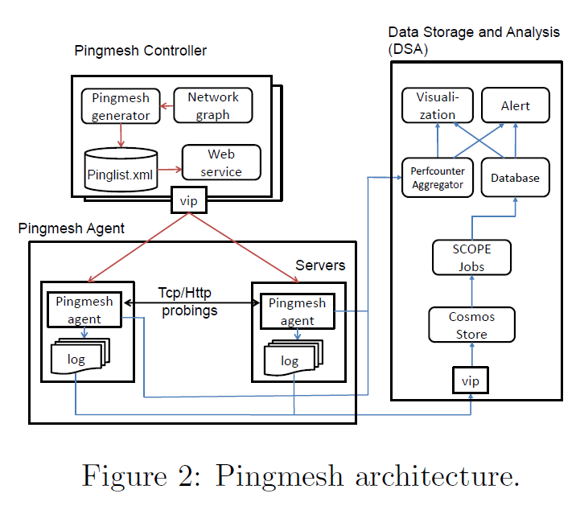

## System

1. Pingmesh Controller
下发pinglist: 

Within a Pod: we let all the servers under the same ToR switch form a complete graph.

Intra-DC algorithm is: for any ToR-pair (ToRx, ToRy), let server i in ToRx ping server i in ToRy.

Inter-DC algorithm is: all the DCs form yet another complete graph. In each DC, we select a number of servers (with several servers selected from each Podset).

2. ping agent

downloads pinglist from the Pingmesh Controller; pings the servers in the pinglist; then uploads the ping result to DSA.

**Pingmesh Controller**: 负责产生pinglist.为了减少probe数目, 设计了多重complete gragh. 分为inter-dc和intra-dc. intra-dc:一个ToR switch看做是一个点. 两个ToR switch: 相同位置的server给相同位置的server发probe. inter-dc: 一个datacenter看做是一个点.
**Pingmesh Agent**: 向controller pull pinglist，TCP/HTTP ping, 上传结果. Every probing needs to be a new connection and uses a new TCP source port. Agent有很多实现上性能和安全的考虑: 严格控制CPU overhead、memory overhead、probe间隔固定为10s. payload 64 bytes.
**Data Storage and Analysis**: 负责分析 产生报告 可视化等

