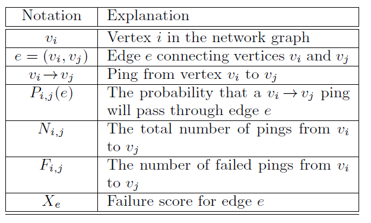
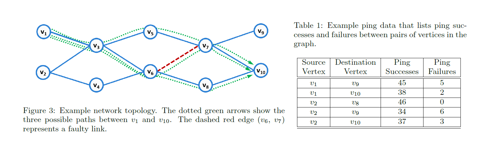
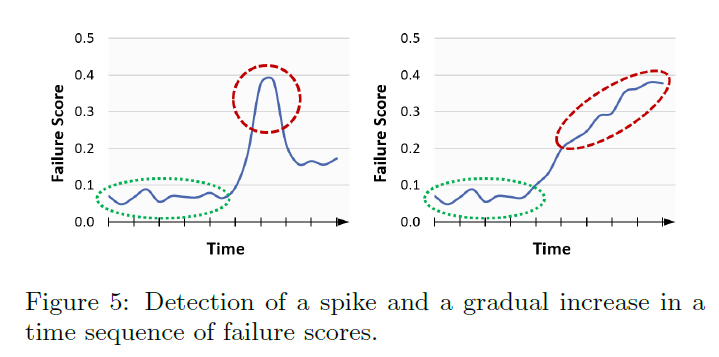

### FAILURE LOCALIZATION
#### Probabilistic Failure Modeling

在两两设备之间去发ping包, 然后以每个link的故障概率为变量用最小均方误差拟合下面的式子
$F_{i, j}=N_{i, j} \cdot P_{i, j}(e) \cdot X_{e}$
其中$F_{i,j}(丢包次数) N_{i,j}(发包总数) P_{i, j}(e)(ping包通过link-e的概率)$都是通过发ping包计算出来的,求$X_{e}$(丢包率)即可
以v1->v10的ping为例子:
Pr[v1->v3->v5->v7->v10] = 0.50
Pr[v1->v3->v6->v7->v10] = 0.25
Pr[v1->v3->v6->v8->v10] = 0.25
假设e = (v6,v7)故障 $P_{1,10}(e)$ = 0.25. $N_{i, j} = 50$ $F_{i,j} = 5$
那么就可以计算出$ X_{e} = 0.4$ 

#### Deviation Detection
因为噪声的存在会导致模型计算出正常链路也会有较低的丢包率
ping会出现噪声如ping包丢失或者rtt时间较长: (a) 链路拥塞导致ping包丢失 (b) ping优先级较低
使用t-test去过滤掉假阳性: 
(1) spike
原假设是新观测值s0属于历史观测值的分布$\mathbb{S}_{h}=\left\{s_{1}, \ldots, s_{n}\right\}$
(2) gradual increase
原假设是对于历史观测集合$\mathbb{S}_{h}=\left\{s_{h}, \ldots, s_{n}\right\}$和当前观测集合$\mathbb{S}_{c}=\left\{s_{0}, \ldots, s_{c}\right\}$ 
$\mu_{c} \leq \theta *\mu_{h}$

每次观测到新的样本时都会执行t检验, 当拒绝原假设时,就将观测的link加入到最终的结果中去
#### Correlation Analysis
假设三条link连接两个设备,那么最终计算出的结果这三条link的错误概率是一样的, 此时会根据SNMP, Netflow...的信息去看哪些link发出警报, 那么这些link就更有可能故障。
