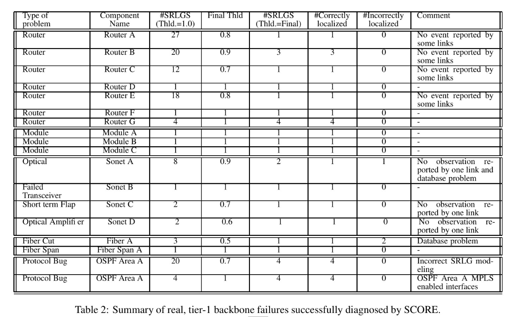
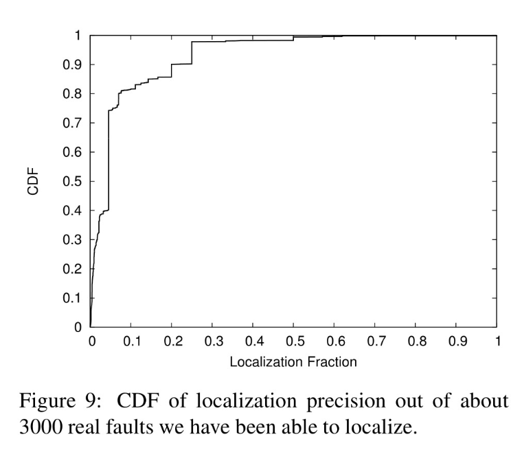

#[NSDI 2005] IP fault localization via risk modeling
## 1. Motivation
- 今天的网络遭受着一系列广泛而不稳定的故障模式，在这些模式中，潜在的故障很难被发现和定位，从而延迟了修复。其中一个主要的挑战来自于实际操作：IP路由和底层光纤设备通常由不同的数据模型描述，并位于不同的网络管理系统中。
- 粗略地说，诸如光纤跨度或光放大器之类的物理对象代表了IP层上一组逻辑实体（例如IP链路）的共同风险组。 也就是说，**如果光学设备发生故障或性能下降，则依赖该对象的所有IP组件都会发生故障或性能下降。文章提出的SCORE模型仅仅使用IP层收集到的信息, 可以去推断IP层和物理层的故障。减轻了运营商对来自两个不同网络层的动态故障信息进行交叉相关的负担。减少故障排查的时间会直接减少停机时间。**

## 2. 共享风险链路组
**硬件相关的SRLG**
1. 光纤(fiber): DWDM能够在同一根光纤中，把不同的波长同时进行组合和传输。一个光纤故障会导致依赖该光线的link(因为一个或者多个link在指定的波长上传输)故障
2. 电缆(fiber span): 一组光纤通过电缆一起携带。一组电缆布置在导管中。一组光纤故障(也就是fibe span故障)会导致依赖该fiber span的链路故障。
3. SONET网络元素: （例如光放大器，分插复用器等）通常跨多个波长（代表电路）共享。 例如，光放大器同时放大所有波长，因此光放大器中的问题可能会破坏所有相关的波长。依赖于相关波长进行传输的link就会故障。
4. 路由器模块(Router modules): 一个路由器由很多模块组成, 每个模块都会影响一个或者多个link
5. 路由器(Router): 会影响和路由器连接的link
6. 端口(ports): 会影响单个link

**软件相关的SRLG**
1. 自治域: 单个自治域内的路由协议发生故障会导致整个AS都故障(不太常见)
2. OSPF区域: 错误的路由协议实现有可能导致整个区域的中断。 因此，特定区域中的IP链接形成OSPF区域SRLG。
(OSPF协议会划分区域)

Fiber span和OSPF area不能被检测到
SONET optical device可以及时识别故障, 但是这些故障是检测波长的, 并不能代表设备故障。 
因此，诊断是基于对相关故障的推断，该故障可以归因于特定的SRLG。 在没有直接来自设备的故障通知的情况下，这成为识别网络中出现故障的组件的唯一方法。

更确切地说，该技术是在一根指定的光纤中，多路复用单个光纤载波的紧密光谱间距，以便利用可以达到的传输性能（例如，达到最小程度的色散或者衰减）。
密集型光波复用（DWDM：Dense Wavelength Division Multiplexing）
SONET （Synchronous Optical Network）同步光纤网络。

## 3. Shared Risk Group analysis
链路集合: 
$C=\left\{c_{1}, c_{2}, \ldots, c_{n}\right\}$
风险组集合: 
$G=\left\{G_{1}, G_{2}, \ldots, G_{n}\right\}$
$G_{i}=\left\{c_{i 1}, c_{i 2}, \ldots, c_{i k}\right\} \subseteq C$

算法的目的是, 给一个假设
$O = \left\{c_{e 1}, c_{e 2}, \ldots, c_{e m}\right\}$
输出最可能的 
$H=\left\{G_{h 1}, G_{h 2}, \ldots, G_{h k}\right\} \subseteq G$
每一个$G_{i}$都是$O$的子集
H是O的集合覆盖.

g5和g6所包含的元素一样, 所以在预处理阶段g5和g6被合并。

指标定义:
 hit ratio = $\left|G_{i} \cap O\right| /\left|G_{i}\right|$
 hit ratio越大表示准确率越高
 coverage ratio = $\left|G_{I} \cap O\right| /|O|$
 coverage ratio越大表示覆盖的数目越多

 
 findCandidateGroup函数的含义是在保证一定准确率的基础上返回覆盖率最大的风险组
命中率(hit ratio)是根据已解释和未解释列表的并集计算的，但覆盖率(coverage ratio)仅基于未解释列表计算。因为某个链路故障可能是因为多种原因的, 所以计算命中率的时候包含两个列表。

然而，由于一些原因，包括不完整或错误的监测数据，以及对共享风险组的不准确建模，导致 hit ratio是小于1的, 所以需要threshold。

## 4. 系统架构

**1. SRLG database**
- 用于在SONET层形成SRGL的数据库原子描述了特定IP链路穿越的SONET和光学层设备id，这些id是从运行的光学元件管理系统填充的数据库中提取的。相当于可以获得IP链路集合和光学层设备id之间的对应关系。
- OSPF Area, router, module相关的SRLG可以通过路由器配置获得。

上述两部分构成了SRLG数据库

**2. SCORE(Spatial correlation engine)**
周期性地从数据库读取数据, 并使用贪婪算法进行故障定位。

**3. Data Source**
a. 一方面, 数据来源于IP层,路由器将观察到IP链路故障和其他故障，并通过路由器发送的SNMP(陷阱)向集中式网络操作系统报告。
b. 另一方面数据来源于SNMP Perfomance report,它通常包含5分钟的统计数据的聚合度量, 如流量、路由器CPU平均利用率、路由器的内存利用率、数据包错误数、数据包丢弃等。许多参数将以15分钟的聚合形式报告。这些参数包括编码违规、出错秒数、严重错误秒数（表示误码率和中断）以及SONET环上的保护切换计数。

**4. Data translation/normalization**
把从不同数据源(来自不同网络元素)获得的数据(格式不同)处理成相同格式的数据。

**5. Fault localization policies**
a. 事件聚类: 把5min之内的事件聚为一类, 但是某个事件可能会导致跨越两个时间周期, 所以采用小于某个时间阈值的事件聚为一类。
因为一个故障可能导致不同的组件反映出不同的事件, 但是这些事件并非同时发生的(因为时间不精准, 传输延时等原因。)这些不同来源(OSPF, Syslog...)的数据需要被聚类表示成为单一事件。
b. Localization heuristics: 设置不同的错误率阈值去获得不同的假设, 使用cost function去获得最好的假设
cost = 最终假设的组数/正确率阈值, 错误率阈值越大, 也就意味着越松弛, 最终假设的组数就会越少。cost是越小越好的。

**6. Implementation**
一个web界面: 观测时间, 故障链路, 风险组, 风险组相关的组件, 参数(hit ration, coverage ratio, threshold)

## 5. Simulated faults(模拟)

a. 理想情况下的模拟(验证贪心算法的正确性): 随机从SRLG数据库中选择SRLG集合任其出故障。然后输入故障链路集合L, 使用SCORE获得假设集合H, 计算准确率。
(因为实际情况下不可能某一模块出故障之后会同时观测到该risk group的链路都出故障。)
在这种情况下无需设置正确率阈值来限制可以选择的SRLG

b. 现实情况下, 有些错误事件可能会由于某些原因没有被报告出来, 这个时候需要设置错误率阈值。在该情况下考虑三个参数: 错误率阈值, 错误概率(没有被报告出来的事件比例), 模拟故障的数目。
- 正确率阈值越大, 准确率越低
- 错误概率越大, 准确率越低
- 故障数目越多, 准确率越低

## 6. 在一层的骨干网路上实验
**18中不同类型的故障进行模拟**
- 通过降低阈值基本上所有的故障都可以推断出正确的SRLG
- 当threshold=1时候,路由器故障和协议故障不能很好被识别出来
- 路由器故障较好识别, 因为影响到的链路一端连接在同一路由器上, 然而物理链路层的故障往往难以识别因为影响到的链路是空间独立(相隔比较远?)的。(因该是因为空间上仅的话日志上的事件更可能聚成一类, 远的话因为时延聚成一类的概率会小一些?)

**准确度**

localization precision = 最终确定的SRLG的数目/总的SRLG的数目
SCORE localizes faults to less than 5% for more than 40% of the failures and to less than 10% for more than 80% of the failures

