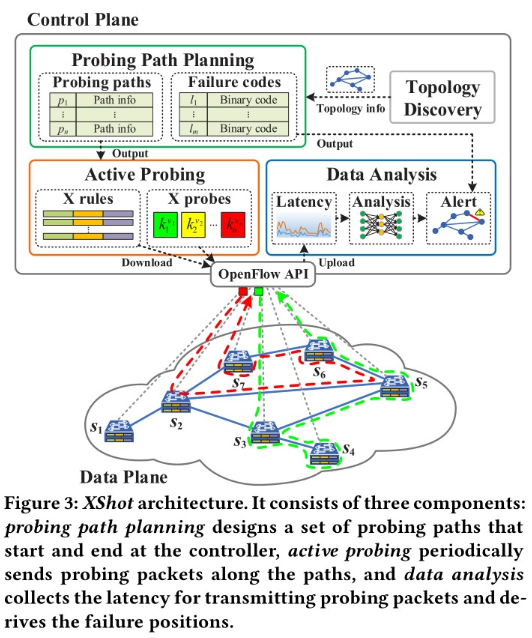
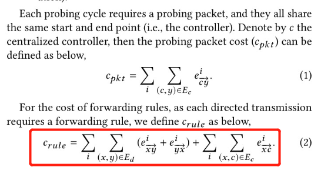
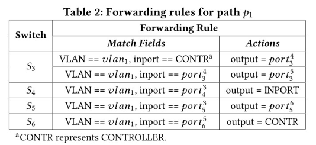
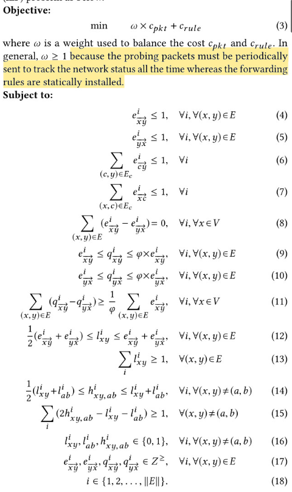
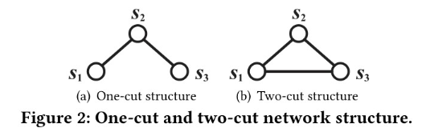
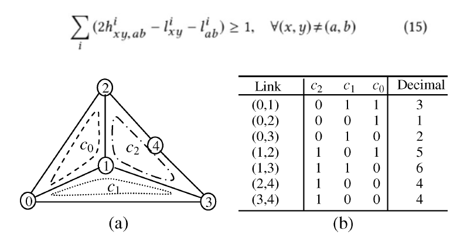
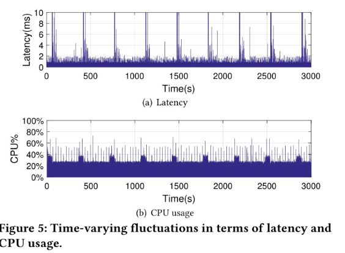

### 系统架构

1. ILP模型规划Cost最小的Probing Cycle, 使用错误码推断fail-stop
2. VAE根据时延推断异常path,进而使用错误码定位partial-failure
## 符号说明
$e_{\bar{x} \vec{y}}^{i}$ 表示link(x,y)在pathi上出现的次数
$q_{\bar{x} y}^{i}$ 
$l_{x y}^{i}$ 表示link(x,y)是否在pathi上面
$h_{x y, a b}^{i}=l_{x y}^{i} \| l_{a b}^{i}$
Ec: 控制器和数据平面之间的链路
Ed: 数据平面中的链路
### ILP模型

P1: c->S3->S4->S3->S5->S6->c

(其中c_rule刚好是path的link数目-1)

**现有的方法中的probing cycle不允许穿过一条link多次, 最多只能穿过一次。会导致one-cut和two-cut结构出问题**

(4)-(5) link(x,y)在一条path的某个方向上最多出现一次
(6)-(7) link(c,y)在所有path的某个方向上最多出现一次
(8) 保证出入守恒, 从某个交换机出去的流的数目等于进入交换机流的数目
(9)-(11) 
(12) 限制l和e之间的关系, lxy是1的时候, exy和eyx至少有一个是1, lxy是0的时候exy和eyx都是0
(13) 每个link至少在某条path上出现过一次, 不然就是没有被探测到
(14) 就是表示了h和l之间的关系, 直接用h12 = l1||l2的形式应该也可以
(15) 确保每条链路有唯一的错误码
**本质上是任意两个错误码相减的绝对值=1,参考下面的例子**

(16)-(18)是定义域的限制
mi: 被i条path穿过的控制链路的数目(正向和反向算一个)
1条: m1
2条: m2
n条: mn
T(mi) 这mi条link被path穿过的次数
**结论**
n是probing path的数目:
$n \geq \max \left\{\left\lceil\log _{2}(\|E\|+1)\right\rceil,\left\lceil\frac{2}{3}\left\|E_{c}\right\|\right\rceil\right\}$

### 流程
1. 构造探测包: 使用vlan-id来区分不同路径上的探测包
2. 定位fail-stop故障, 发包间隔在分钟级别。定位partial-failure故障, 发包间隔在ms级别。
3. 记录延迟, 延迟初始值为0, 收到包之后会更新延迟, 在下一次发包之前如果延迟还是0, 那么说明上一轮探测出现fail-stop故障, 使用错误码定位。
4. Donut VAE模型来识别high-latency导致的故障, 获得异常路径后进而使用错误码定位partial-failure
5. 在实验中发现latency抖动的噪音影响partial-failure, 所以连续两次发探测包的结果一致才会认定为partial-failure.

### 场景
单向故障: 比如单向的拥塞, Xshot无法检测到。但是也可以两个方向发双倍的包来进行检测, 但是占用的资源会更多一些
交换机故障判定: 假设link都是正常的, 然后使用0-1来表示交换机
多故障: Xshot无法判定
持续时间很短的故障: Xshot无法判定, 但是也无妨, 因为持续时间太短的故障很快就恢复了
